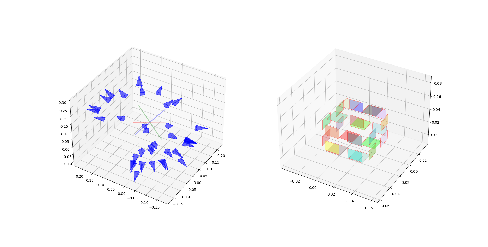
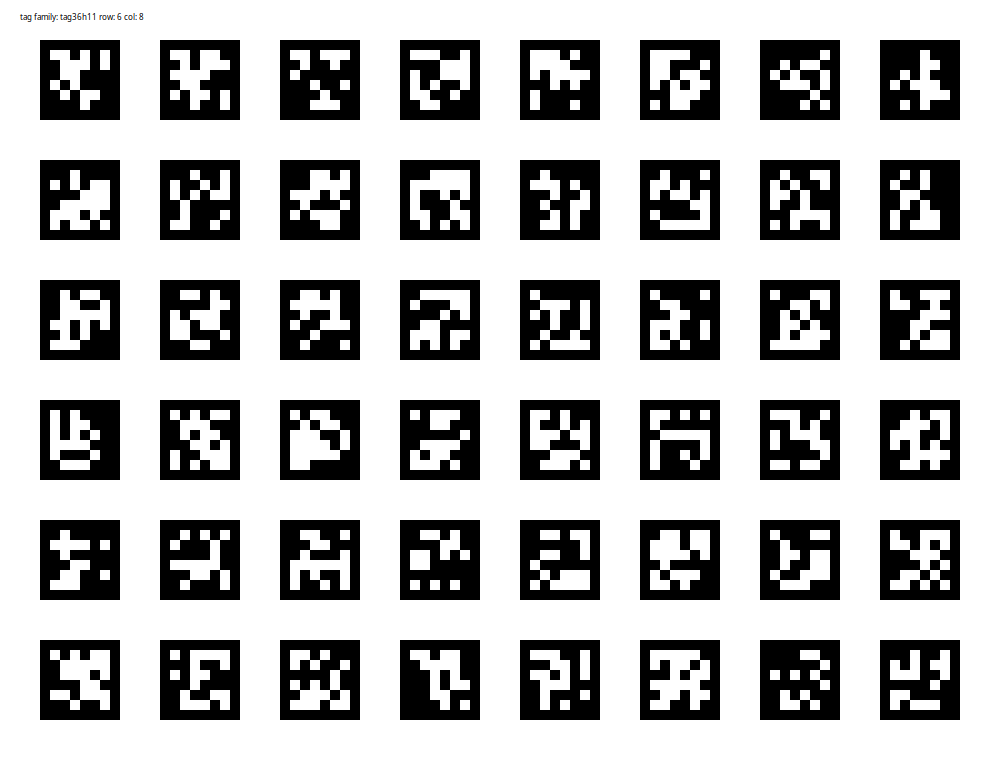

# Apriltag Tag Bundle Calibration Tool

[中文文档](./readme_cn.md)

This toolkit uses gtsam to calibrate Tag Bundles and recover the relative poses of multiple tags from a series of images.

## Final Result

Capture dozens of images of the Tag Bundle to be calibrated from multiple angles.


The calibrated results show the camera's pose relationship with the tags and the results after calibration. In addition, the relative angles between the six faces of the cube are also calculated. For the standard cube, the calibration error of the validation dataset is:

```shell
max error  0.21796414996248784
avr error 0.10711245217531891
```



## Dataset for test

Example images and camera calibration results can be downloaded from here [google_drive](https://drive.google.com/file/d/11k1m0Q2mUbp0rxg8_eLo6up_41Tp__8e/view?usp=sharing)

## Install

### Requirment

```shell
pip install -e .
```

## Usage

### Camera Calibrate

Camera calibration can be done through calibrate_monocamera.py, this script uses Apriltag Grid Pattern for calibration, and the [apriltag_board_generate](https://github.com/ZXW2600/apriltag_board_generate.git) tool can be used to generate it



#### Calibration pattern generate

```shell
git clone https://github.com/ZXW2600/apriltag_board_generate.git
cd apriltag_board_generate
python apriltag_generate.py -f tag36h11 -s 0.0164 -r 6 -c 8 -t 0.0082 -o output/tag36_6x8  -di
```

The calibration board configuration file used for calibration will be generated in output/tag36_6x8.yaml

#### Image Capture

Print the calibration board or directly open the calibration board on the display, use the camera to shoot the calibration board from multiple angles. The test dataset can be obtained from [google drive](https://drive.google.com/file/d/1NkC0lnTKcPBemN78WzJNqUPJvMJkoj__/view?usp=sharing),Includes calibration board configuration and pictures taken by the camera. After decompression, it has the following files:

```shell
 camera_prox1
 ├── IMG_20240212_162933.jpg
 ├── IMG_20240212_162935.jpg
 ├── IMG_20240212_162937.jpg
 ├── IMG_20240212_162938.jpg
 ├── IMG_20240212_162940.jpg
 ├── IMG_20240212_162941.jpg
 ├── IMG_20240212_162943.jpg
 ├── IMG_20240212_162945.jpg
 ├── IMG_20240212_162946.jpg
 ├── IMG_20240212_162948.jpg
 ├── IMG_20240212_162951.jpg
 ├── IMG_20240212_162952.jpg
 ├── IMG_20240212_162953.jpg
 └── tag36_pad.yaml
```

#### Run Calibrate

Usage

```shell
usage: calibrate_monocamera.py [-h] -i IMAGE -t TAG [-o OUTPUT]

options:
  -h, --help                        show this help message and exit
  -i IMAGE, --image     IMAGE       folder path to the input image
  -t TAG,   --tag       TAG         tag config file
  -o OUTPUT, --output   OUTPUT      output file name
```

```shell
python calibrate_monocamera.py -i camera_prox1/ -t camera_prox1/tag36_pad.yaml
```

The calibration parameter file will be generated by default in config/camera_calib.yaml.

### Apriltag Bundle Calibrate

The structure of cube dataset [google_drive](https://drive.google.com/file/d/11k1m0Q2mUbp0rxg8_eLo6up_41Tp__8e/view?usp=sharing) after decompression is as follows:"

```shell
├── bundle0
│   ├── IMG_20240212_161546.jpg
│   ......
│   ├── IMG_20240212_162910.jpg
│   └── IMG_20240212_162912.jpg
└── pro_1x.yaml
```

Calibration can be achieved through bundle_calibrate.py

```shell
usage: bundle_calibrate.py [-h] -c CAMERA -i IMAGE [-o OUTPUT] -t TAG -s SIZE [-at AID_TAG] [-as AID_SIZE] [-ac AID_TAG_CONFIG]
                           [-d DRAW] [-dw DRAW_WIDTH]

options:
  -h, --help            show this help message and exit
  -c CAMERA, --camera CAMERA
                        path to the camera calibrate file
  -i IMAGE, --image IMAGE
                        folder path to the input image
  -o OUTPUT, --output OUTPUT
                        output file name
  -t TAG, --tag TAG     tag family
  -s SIZE, --size SIZE  tag size
  -at AID_TAG, --aid_tag AID_TAG
                        aid tag family
  -as AID_SIZE, --aid_size AID_SIZE
                        aid tag size
  -ac AID_TAG_CONFIG, --aid_tag_config AID_TAG_CONFIG
                        aid tag config file
  -d DRAW, --draw DRAW  path to save detect result
  -dw DRAW_WIDTH, --draw_width DRAW_WIDTH
```

example

```shell
python bundle_calibrate.py -c pro_1x.yaml -i bundle0 -t tag25h9 -s 0.0194
```

The parameters after calibration will be saved in bundle_result.yaml

### Result Visualization

The visualization of the results can be achieved through vis_bundle.py.
Usage:

```shell
usage: vis_bundle.py [-h] -i INPUT [-s SIZE] [-test_cube]

options:
  -h, --help            show this help message and exit
  -i INPUT, --input INPUT
                        path to the bundle calibrate file
  -s SIZE, --size SIZE  visual size of the tag
  -test_cube            calculate error for cube dataset
```

For the given cube dataset, the test_cube option will calculate the error of the angles between the 6 faces.

```shell
near angles [90.18535239334669, 89.86741119876115, 90.01369472470303, 89.98496834298389, 90.05906309706685, 90.13638450006404, 89.92130688636414, 90.00989980543098, 90.16028968795261, 89.9644745135422, 90.12733970357714, 90.02288525377122]
opsite angles [0.20115007127468132, 0.2179664187125231, 0.21082074494093075]
max error  0.2179664187125231
avr error 0.10711236394595476
```

## TODO List


