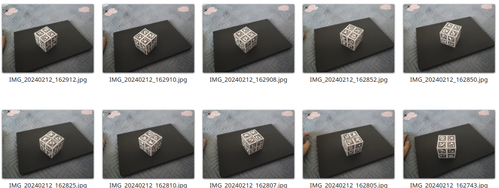
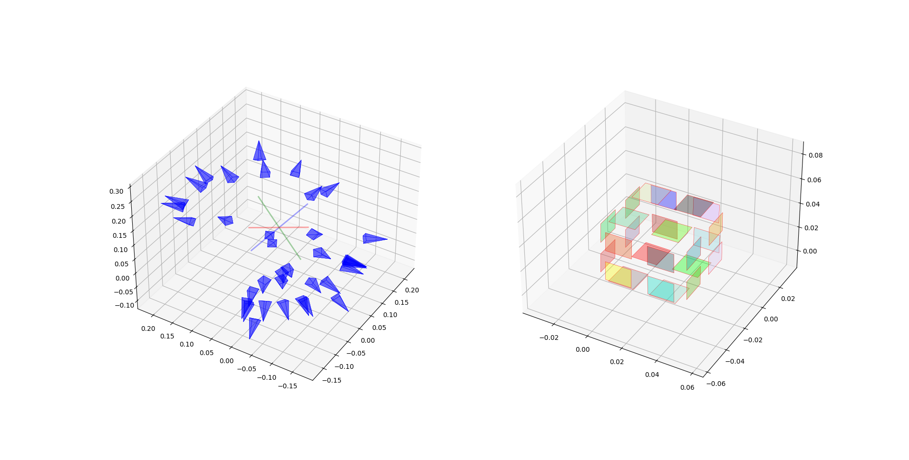
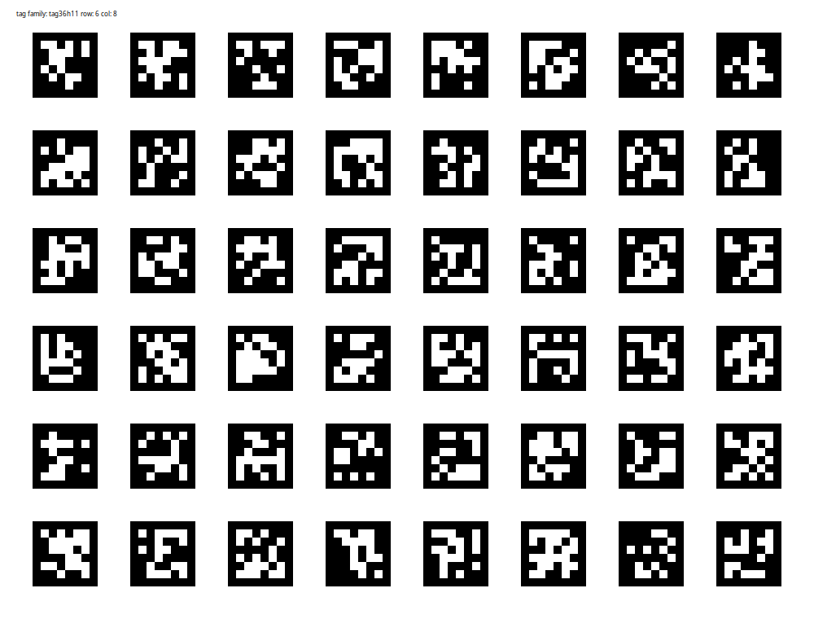

# Apriltag Tag Bundle标定工具

本工具包使用gtsam完成对Tag Bundle的标定，从一系列图像中恢复多个Tag的相对位姿

## 最终效果

从多个角度拍摄待标定的Tag Bundle，取得数十张图像


标定后的结果显示了相机与Tag的位姿关系以及标定后的结果，此外还计算了正方体六个面的相对夹角。对于标准立方体，验证数据集标定误差为：

```shell
max error  0.21796414996248784
avr error 0.10711245217531891
```



## 验证数据集

案例图片和相机标定结果可以从此处下载 [google_drive](https://drive.google.com/file/d/11k1m0Q2mUbp0rxg8_eLo6up_41Tp__8e/view?usp=sharing)

## 安装

```shell
pip install -e .
```

## 使用

### 相机标定

相机标定可以通过calibrate_monocamera.py完成，本脚本使用Apriltag Gird Pattern进行标定，可以通过[apriltag_board_generate](https://github.com/ZXW2600/apriltag_board_generate.git)工具生成



#### 标定板生成

```shell
git clone https://github.com/ZXW2600/apriltag_board_generate.git
cd apriltag_board_generate
python apriltag_generate.py -f tag36h11 -s 0.0164 -r 6 -c 8 -t 0.0082 -o output/tag36_6x8  -di
```

用于标定的标定板配置文件将会在output/tag36_6x8.yaml生成。

#### 图像采集

打印标定板或直接在显示器打开标定板，使用相机从多个角度拍摄标定板。测试数据集可以从[google drive](https://drive.google.com/file/d/1NkC0lnTKcPBemN78WzJNqUPJvMJkoj__/view?usp=sharing)下载，包含标定板配置和相机拍摄的图片。解压后具有如下文件：

```shell
 camera_prox1
 ├── IMG_20240212_162933.jpg
 ├── IMG_20240212_162935.jpg
 ├── IMG_20240212_162937.jpg
 ├── IMG_20240212_162938.jpg
 ├── IMG_20240212_162940.jpg
 ├── IMG_20240212_162941.jpg
 ├── IMG_20240212_162943.jpg
 ├── IMG_20240212_162945.jpg
 ├── IMG_20240212_162946.jpg
 ├── IMG_20240212_162948.jpg
 ├── IMG_20240212_162951.jpg
 ├── IMG_20240212_162952.jpg
 ├── IMG_20240212_162953.jpg
 └── tag36_pad.yaml
```

#### 参数标定

Usage

```shell
usage: calibrate_monocamera.py [-h] -i IMAGE -t TAG [-o OUTPUT]

options:
  -h, --help                        show this help message and exit
  -i IMAGE, --image     IMAGE       folder path to the input image
  -t TAG,   --tag       TAG         tag config file
  -o OUTPUT, --output   OUTPUT      output file name
```

```shell
python calibrate_monocamera.py -i camera_prox1/ -t camera_prox1/tag36_pad.yaml
```

标定的参数文件默认会在config/camera_calib.yaml生成.

### Apriltag标定

验证数据集[google_drive](https://drive.google.com/file/d/11k1m0Q2mUbp0rxg8_eLo6up_41Tp__8e/view?usp=sharing)解压后结构如下：

```shell
├── bundle0
│   ├── IMG_20240212_161546.jpg
│   ......
│   ├── IMG_20240212_162910.jpg
│   └── IMG_20240212_162912.jpg
└── pro_1x.yaml
```

标定可以通过bundle_calibrate.py实现

```shell
usage: bundle_calibrate.py [-h] -c CAMERA -i IMAGE [-o OUTPUT] -t TAG -s SIZE [-at AID_TAG] [-as AID_SIZE] [-ac AID_TAG_CONFIG]
                           [-d DRAW] [-dw DRAW_WIDTH]

options:
  -h, --help            show this help message and exit
  -c CAMERA, --camera CAMERA
                        path to the camera calibrate file
  -i IMAGE, --image IMAGE
                        folder path to the input image
  -o OUTPUT, --output OUTPUT
                        output file name
  -t TAG, --tag TAG     tag family
  -s SIZE, --size SIZE  tag size
  -at AID_TAG, --aid_tag AID_TAG
                        aid tag family
  -as AID_SIZE, --aid_size AID_SIZE
                        aid tag size
  -ac AID_TAG_CONFIG, --aid_tag_config AID_TAG_CONFIG
                        aid tag config file
  -d DRAW, --draw DRAW  path to save detect result
  -dw DRAW_WIDTH, --draw_width DRAW_WIDTH
```

example

```shell
python bundle_calibrate.py -c pro_1x.yaml -i bundle0 -t tag25h9 -s 0.0194
```

标定后的参数会保存在bundle_result.yaml

### 结果可视化

结果的可视化可以通过vis_bundle.py实现。

Usage:

```shell
usage: vis_bundle.py [-h] -i INPUT [-s SIZE] [-test_cube]

options:
  -h, --help            show this help message and exit
  -i INPUT, --input INPUT
                        path to the bundle calibrate file
  -s SIZE, --size SIZE  visual size of the tag
  -test_cube            calculate error for cube dataset
```

对于给定cube数据集，test_cube选项会计算6个面夹角的误差。

```shell
near angles [90.18535239334669, 89.86741119876115, 90.01369472470303, 89.98496834298389, 90.05906309706685, 90.13638450006404, 89.92130688636414, 90.00989980543098, 90.16028968795261, 89.9644745135422, 90.12733970357714, 90.02288525377122]
opsite angles [0.20115007127468132, 0.2179664187125231, 0.21082074494093075]
max error  0.2179664187125231
avr error 0.10711236394595476
```

## TODO List


